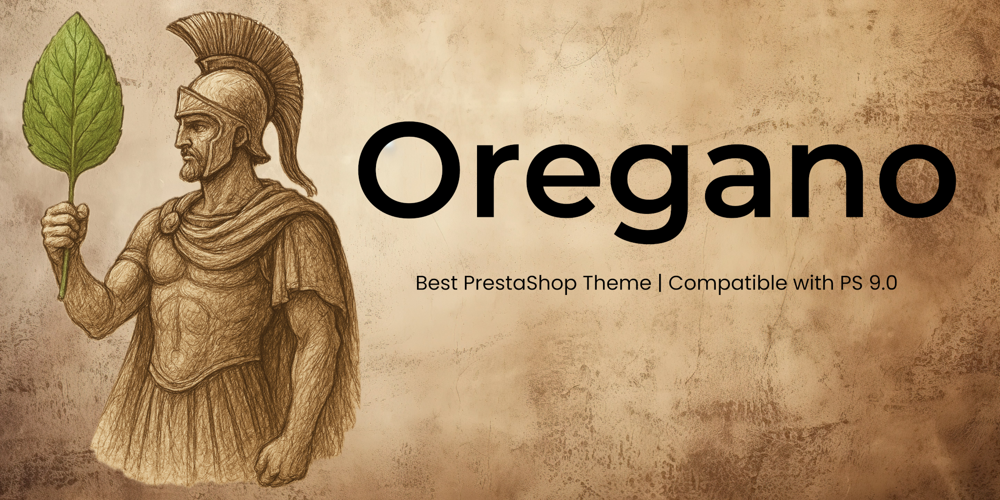

    

  
  
  
  
  
  
  

  
  
  

Oregano is a custom PrestaShop theme based on the [default PrestaShop theme](https://github.com/PrestaShop/hummingbird).  
It is designed for PrestaShop `9.0.x`, so please make sure you are using that branch to ensure compatibility.

---

## How to Build Assets

Same as the PrestaShop project, you need at least **NodeJS 20.x** and **NPM 8** in order to build the project.

First you need to install every node module:

`npm ci`

then create a `.env` file inside the *webpack* folder by copying `webpack/.env-example` and complete it with your environment's informations. Please use a free tcp port.

then build assets:

`npm run build`

---

## Contributing

We welcome contributions! Please refer to the [Oregano contributing guide](https://github.com/turtle-key/oregano/blob/main/CONTRIBUTING.md) for guidelines.

---

## Continuous Integration

The CI pipeline runs the following checks:  
- Stylelint for CSS/SCSS  
- ESLint for JavaScript  
- TypeScript type checks

---

## License

This theme is released under the [GNU Affero General Public License v3.0 (AGPL-3.0)](LICENSE)
</pre>
